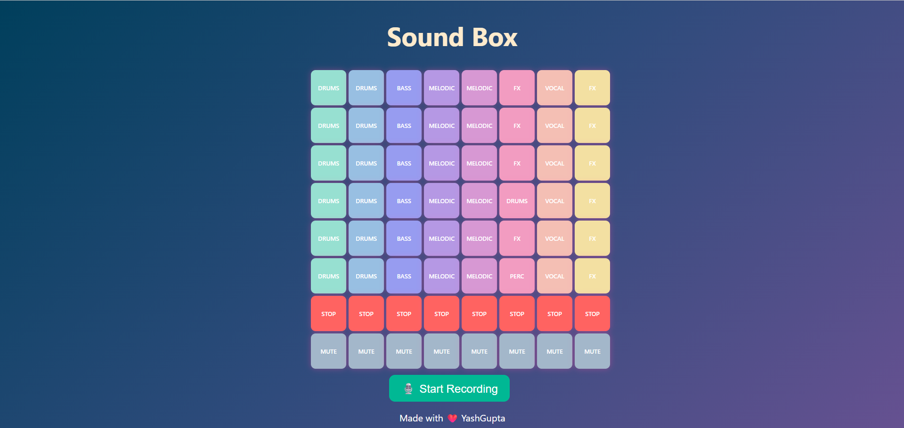

# 🎧 Hip-Hop SoundBox 🎵

A fully functional and responsive **Hip-Hop Soundbox Website** created using **HTML, CSS, and JavaScript**. This project allows users to play and mix categorized hip-hop sound samples using a grid-style launchpad interface. Ideal for music lovers and beginner-level audio interaction projects.

## 🔗 Live Demo

👉 [Launch the SoundBox](https://yashgupta7373.github.io/Hip-Hop-SoundBox/)

## 📁 GitHub Repository

👉 [View Code on GitHub](https://github.com/yashgupta7373/Hip-Hop-SoundBox)

## 📸 Screenshot



---

## ✨ Features

- 🎼 Play different hip-hop sound samples
- 🟦 Categorized by DRUMS, BASS, MELODIC, FX, and VOCAL
- ▶️ Only one sound per column plays at a time
- 🔇 MUTE button for each column
- ⛔ STOP button to stop sound in that column
- 🧱 Grid-based launchpad layout
- 🎨 Stylish and responsive UI design

---

## 🛠️ Tech Stack

- **HTML5** – Structure and layout
- **CSS3** – Styling and responsiveness
- **JavaScript** – Sound control, logic, and event handling

## 💡 Project Purpose

- This project was built to:
- Practice audio control using JavaScript
- Create interactive UI for real-time music mixing
- Explore how categorized audio buttons can simulate a launchpad
- Build a fun and engaging web-based sound experience

---

## 🚀 How to Use (Clone & Run Locally)

```bash
# Clone the repository
git clone https://github.com/yashgupta7373/Hip-Hop-SoundBox.git

# Navigate to the project folder
cd Hip-Hop-SoundBox

# Open the app in your browser
Open index.html in any browser

Made with ❤️ by Yash Gupta
